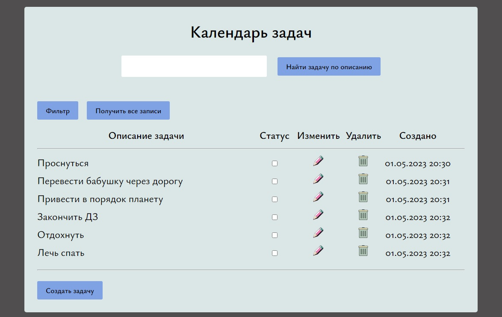
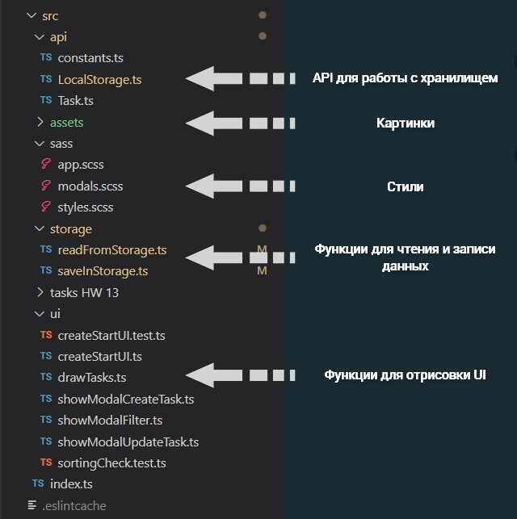

<h1 align="center">Календарь задач (+ задачи на типизацию)</h1>

_**[Развёрнуто здесь](https://djess-v.github.io/otus--homework--13/)**_

---

<h2>Визуальное представление</h2>

<h2>Описание приложения</h2>

При открытии страницы вы увидите календарь задач с одной записью. Пройдёмся по функционалу кнопок, ограничениям и возможностям приложения:

"Создать задачу" - открывает модальное окно для создания новой задачи. Поле "Опишите задачу" оставлять пустым нельзя, поле "Теги" - можно оставить незаполненным. Теги, если вы их ввели, отображаются при наведении указателя мыши на строку описания задачи. Скрипты в данные поля ввода вводить не следует.

"Найти задачи по описанию" - отбор записей по описанию задачи. Будут найдены все записи, в которых встречается тот набор символов, которые вы ввели. 

"Получить все записи" - кнопка, которая может пригодиться когда вы отобрали записи с помощью формы для поиска и вам необходимо вернуть все записи, которые у вас храняться в хранилище.  

"Фильтр" - открывает модальное окно для сортировки имеющихся записей по алфавиту(от А до Я, от Я до А) - сортируется по полю "описания задачи", по дате создания записи (сначала новые записи, сначала старые записи), по статусу (сначала выполненные, сначала невыполненные) и по тегам (вводите теги через запятую) - сначала отобразятся те записи, в которых найдено больше соответствий по значениям. Если вы отметите недостаточно пунктов для сортировки - получите уведомление об этом.

Задачи можно удалять, менять статус(выполненно/невыполненно) или редактировать, воспользовавшись соответствующими значками каждой задачи. При редактировании откроется модальное окно для внесения изменений. Пустая строка недопустима! Хотите удалить - воспользуйтесь кнопкой с мусорным ведром.

Все данные храняться у вас в браузере.

<h2>Структура проекта</h2>

